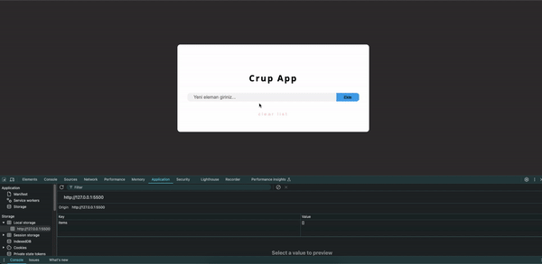

# CRUD App

## Purpose
The CRUD App is a web application designed to allow users to create, read, update, and delete data. This application aims to demonstrate the basic CRUD operations and the capability to build dynamic user interfaces using JavaScript.

## Technologies Used
- **HTML5**: Used to structure the application.
- **CSS3**: Used to style and enhance the appearance of the application.
- **JavaScript (ES6+)**: Used to make the application dynamic and interactive.
- **LocalStorage**: Used to store and manage user data in the browser.

## Features
1. **Create Data**: Users can add new items.
2. **Read Data**: Users can view existing items.
3. **Update Data**: Users can edit existing items.
4. **Delete Data**: Users can remove existing items.
5. **Store Data in LocalStorage**: Data is preserved even after the page is reloaded or the browser is closed and reopened.
6. **Retrieve Data from LocalStorage**: The application retrieves and displays data stored in the browser.
7. **Update and Delete Data**: The application can update or delete stored data.
8. **User Feedback**: Informative messages are shown to users after actions (e.g., item added, item updated, item deleted).
9. **Responsive Design**: The application looks good on various devices and screen sizes.
10. **Simple and User-Friendly Interface**: A clear and easy-to-use interface is provided.

## Usage
1. Open the application and fill out the form to add a new item.
2. View the list of created items.
3. Click the edit button to modify an existing item.
4. Click the delete button to remove an existing item.
5. Observe that your data is retained even after closing and reopening the application.

## Installation and Running 
1. Clone the project from GitHub: `git clone <repository_url>` 
2. Navigate to the project directory: `cd <project_directory>` 
3. Open the project with a web server (for example, you can use the VS Code Live Server extension).

## Short GIF 
